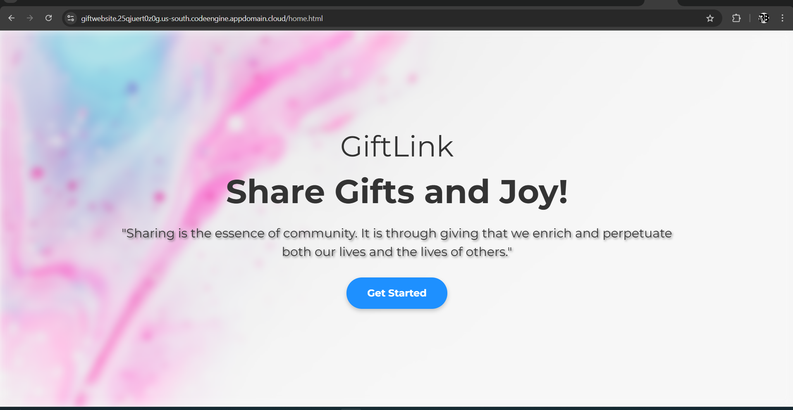
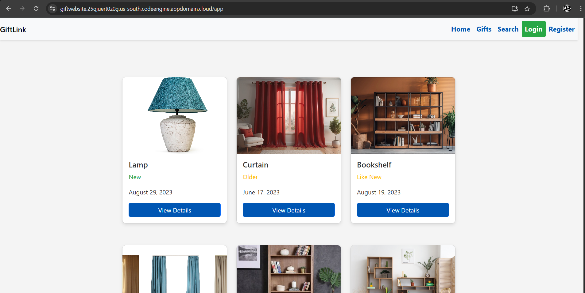
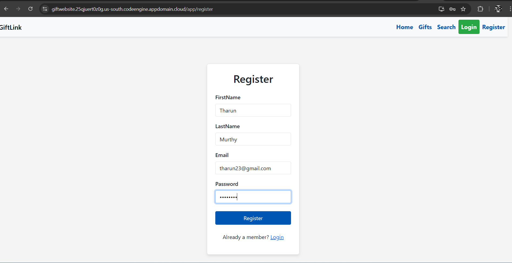
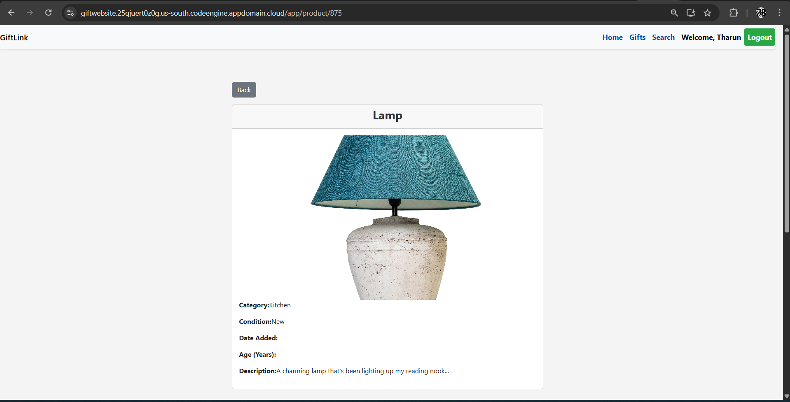
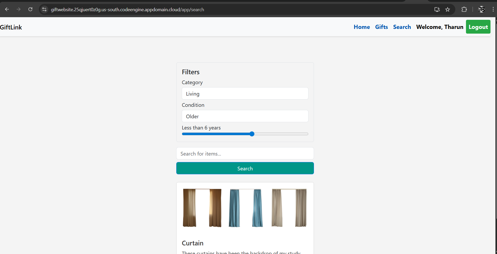

# GiftLink – Full Stack Capstone Project

GiftLink is a full-stack web application that allows users to browse, search, and share gifts based on category, condition, and age.  
This project was built as part of the **IBM / Coursera Full Stack Capstone Project** and demonstrates end-to-end development, containerization, and cloud deployment.

---

## 🚀 Features

- Browse all available gifts
- View gift details
- Search gifts by category and condition
- User registration and login with JWT authentication
- Sentiment analysis integration
- RESTful API backend
- Fully containerized frontend and backend
- Deployed using Kubernetes and IBM Code Engine

---

## 🛠️ Tech Stack

### Frontend
- React
- JavaScript
- HTML / CSS
- Fetch API

### Backend
- Node.js
- Express.js
- MongoDB
- Mongoose
- JWT Authentication

### DevOps / Cloud
- Docker
- Kubernetes
- IBM Cloud Container Registry
- IBM Code Engine
- GitHub Actions (CI/CD)

## 📂 Project Structure

```text

 📂fullstack-capstone-project
  ┣ 📂.github
  ┃ ┣ 📂ISSUE_TEMPLATE
  ┃ ┃ ┗ 📜user-story-.md   # Agile User Stories 
  ┃ ┗ 📂workflows
  ┃   ┗ 📜main.yml   # CI/CD workflow
  ┣ 📂giftlink-backend
  ┃ ┣ 📂models
  ┃ ┃ ┗ 📜db.js
  ┃ ┣ 📂routes
  ┃ ┃ ┣ 📜authRoutes.js
  ┃ ┃ ┣ 📜giftRoutes.js
  ┃ ┃ ┗ 📜searchRoutes.js
  ┃ ┣ 📂util
  ┃ ┃ ┗ 📂import-mongo
  ┃ ┃   ┣ 📜.env.sample  # Sample .env 
  ┃ ┃   ┣ 📜gifts.json
  ┃ ┃   ┣ 📜index.js
  ┃ ┃   ┗ 📜package.json
  ┃ ┣ 📜.env.sample   # Sample .env 
  ┃ ┣ 📜app.js 
  ┃ ┣ 📜logger.js
  ┃ ┗ 📜package.json
  ┣ 📂giftlink-frontend
  ┃ ┣ 📂public
  ┃ ┃ ┣ 📂images    # Contains images for frontend 
  ┃ ┃ ┣ 📂static    # contains static files 
  ┃ ┃ ┣ 📜.DS_Store
  ┃ ┃ ┣ 📜favicon.ico
  ┃ ┃ ┣ 📜home.html
  ┃ ┃ ┣ 📜index.html
  ┃ ┃ ┣ 📜logo192.png
  ┃ ┃ ┣ 📜logo512.png 
  ┃ ┃ ┣ 📜manifest.json
  ┃ ┃ ┗ 📜robots.txt
  ┃ ┣ 📂src
  ┃ ┃ ┣ 📂components
  ┃ ┃ ┃ ┣ 📂DetailsPage
  ┃ ┃ ┃ ┃ ┣ 📜DetailsPage.css
  ┃ ┃ ┃ ┃ ┗ 📜DetailsPage.js
  ┃ ┃ ┃ ┣ 📂LoginPage
  ┃ ┃ ┃ ┃ ┣ 📜LoginPage.css
  ┃ ┃ ┃ ┃ ┗ 📜LoginPage.js
  ┃ ┃ ┃ ┣ 📂MainPage
  ┃ ┃ ┃ ┃ ┗ 📜MainPage.js
  ┃ ┃ ┃ ┣ 📂Navbar
  ┃ ┃ ┃ ┃ ┗ 📜Navbar.js
  ┃ ┃ ┃ ┣ 📂Profile
  ┃ ┃ ┃ ┃ ┣ 📜Profile.css
  ┃ ┃ ┃ ┃ ┗ 📜Profile.js
  ┃ ┃ ┃ ┣ 📂RegisterPage
  ┃ ┃ ┃ ┃ ┣ 📜RegisterPage.css
  ┃ ┃ ┃ ┃ ┗ 📜RegisterPage.js
  ┃ ┃ ┃ ┗ 📂SearchPage
  ┃ ┃ ┃   ┣ 📜SearchPage.css
  ┃ ┃ ┃   ┗ 📜SearchPage.js
  ┃ ┃ ┣ 📂context 
  ┃ ┃ ┃ ┗ 📜AuthContext.js
  ┃ ┃ ┣ 📜App.css
  ┃ ┃ ┣ 📜App.js
  ┃ ┃ ┣ 📜config.js
  ┃ ┃ ┣ 📜index.css
  ┃ ┃ ┗ 📜index.js
  ┃ ┣ 📜.env.sample
  ┃ ┗ 📜package.json
  ┣ 📂sentiment
  ┃ ┣ 📜index.js
  ┃ ┗ 📜package.json
  ┣ 📜.gitignore
  ┣ 📜LICENSE
  ┗ 📜README.md
```

## 🗄️ Database

- MongoDB is used as the primary database
- A total of 16 gift documents are imported into the gifts collection
- Database connection is handled in:
   ```text
    giftlink-backend/models/db.js
   ```

## 🔌 API Endpoints

#### Gifts

- `GET /api/gifts` – Get all gifts
- `GET /api/gifts/:id` – Get gift by ID

#### Search 

- `GET /api/search?category=<category> ` - Search gifts by category


#### Authentication 

- `POST /api/register` – Register new user
- `POST /api/login` – Login user

## ☁️ Deployment

Backend

- Containerized with Docker
- Deployed on Kubernetes (Skills Network)
- Connected to MongoDB via Kubernetes Service

Frontend

- Containerized with Docker
- Deployed on IBM Code Engine
- Publicly accessible URL

## 🧪 CI/CD

- GitHub Actions used for Continuous Integration
- Pipeline validates builds and runs successfully before deployment

## 📸 Screenshots

- **Landing page**



- **Main page (before login)**


- **User registration**


- **Logged-in user view**


- **Gift details page**


- **Search results page**

